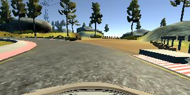

## 行为克隆

整个克隆的流程如下：
* 使用模拟器采集数据，使用的是udacity提供的数据
* 数据处理，获取更多的数据
* 建立模型
* 训练模型和模型测试
* 在模拟器中测试模型
* 总结


1. 使用模拟器采集数据

   > 使车辆在track1中心跑一圈，在车道的右边跑一圈，向车道的反方向中心跑一圈。后来发现在车辆在第二个左转弯的处没有转过去，重新记录了一遍在此处的数据（哪个地方不会，就多教教它），但是采集的数据训练之后效果都不好，后面使用的是udacity提供的数据。
   >

   

2. 为了得到更多的数据，对原始数据进行了扩充。

   > 图片随机进行水平翻转，同时角度变为反方向值。

   ```python
   def random_img_flip(img, angle):
       """
       图像水平翻转
       :param img: 
       :param angles: 
       :return: 
       """

       rand = np.random.rand()
       if rand > 0.5:
           img = cv2.flip(img, 1)
           angle = -angle
       return img, angle
   ```

   

   ​           			 原始图像								水平翻转后的图像

   >  保留左右摄像头拍摄的图片，随机获取左，中，右中的一张图片，且左边角度加0.2，中间不变，右边减0.2。

   ```python
   def random_img_choose(sample):
       """
       加载图像，可能是左，中，右其中一个
       :return: 
       """
       choice = np.random.choice(3, 1)
       if choice == 0:
           name = './data/IMG/' + sample[0].split("/")[-1]
           center_image = cv2.imread(name)
           center_angle = float(sample[3])
       elif choice == 1:
           name = './data/IMG/' + sample[1].split("/")[-1]
           center_image = cv2.imread(name)
           center_angle = float(sample[3]) + 0.2
       else:
           name = './data/IMG/' + sample[2].split("/")[-1]
           center_image = cv2.imread(name)
           center_angle = float(sample[3]) - 0.2
       return center_image, center_angle
   ```

   

   如上的图片分别为左，中，右摄像头采集的图像数据。

3. 数据预处理

   >读入数据

   ```python
   import csv
   from sklearn.model_selection import train_test_split
   from sklearn.utils import shuffle
   import numpy as np
   import cv2

   samples = []
   def read_lines():
       """
       读取转动角度数据
       """
       with open('./nnn/driving_log.csv') as file:
           reader = csv.reader(file)
           for i, line in enumerate(reader):
               if i > 0:
                   samples.append(line)
       return samples

   # 打乱数据
   shuffle(samples)
   #把总体的数据分为训练集和验证集
   samples = read_lines()
   train_samples, validation_samples = train_test_split(samples, test_size=0.2)
   ```

   > 为了节省内存，使用了生成器，且对每一批次的数据，这样就不用把所有的图像数据一次性放入内存中，需要的时候再取。

   ```python
   def next_batch(samples, batch_size=32):                                    
       """                                                                    
       获取一个批次的数据                                                              
                                                                              
       :param samples:                                                        
       :param batch_size:                                                     
       :return:                                                               
       """                                                                    
                                                                              
       shuffle(samples)                                                       
       num_samples = len(samples)                                             
       while 1:  # Loop forever so the generator never terminates             
           for offset in range(0, num_samples, batch_size):                   
               batch_samples = samples[offset:offset + batch_size]            
               images = []                                                    
               angles = []                                                    
               for i, sample in enumerate(batch_samples):                     
                   img, angle = random_img_choose(sample)                     
                   img, angle = random_img_flip(img, angle)                   
                   images.append(img)                                         
                   angles.append(angle)                                       
           yield shuffle(np.array(images), np.array(angles))                  
                                                                              
   ```

4. 建立模型

   > 使用keras能快速建立模型，模型结构从如下代码观察一目了然。	
   >
   > 该模型使用的是NVIDA的模型，这个模型是经过检测的，所以结果很不错。自己构建的模型和这个差距很大。
   >
   > 注意：在模型内部对数据进行了裁剪和归一化处理。

   ```python
   from keras.layers.core import Flatten, Dense, Activation
   from keras.layers.convolutional import Convolution2D
   from keras.models import Sequential
   from keras.layers import Cropping2D
   from keras import backend as K
   from keras.layers import Lambda

   # 建立模型，训练                                                             
   def create_model_architecture():                                      
       """                                                               
       创建训练模型,参考NVIDA                                                    
       :return:                                                          
       """                                                               
       model = Sequential()                                              
       model.add(Lambda(lambda x: x / 255 - 0.5, input_shape=(160, 320, 3
       model.add(Cropping2D(cropping=((60, 20), (0, 0))))                
       model.add(Convolution2D(24, 5, 5, subsample=(2, 2)))              
       model.add(Activation('relu'))                                     
       model.add(Convolution2D(36, 5, 5, subsample=(2, 2)))              
       model.add(Activation('relu'))                                     
       model.add(Convolution2D(48, 5, 5, subsample=(2, 2)))              
       model.add(Activation('relu'))                                     
       model.add(Convolution2D(64, 3, 3))                                
       model.add(Activation('relu'))                                     
       model.add(Convolution2D(64, 3, 3))                                
       model.add(Activation('relu'))                                     
       model.add(Dropout(0.5))                                           
       model.add(Flatten())                                              
       model.add(Dense(1164))                                            
       model.add(Activation('relu'))                                     
       model.add(Dense(100))                                             
       model.add(Activation('relu'))                                     
       model.add(Dense(50))                                              
       model.add(Activation('relu'))                                     
       model.add(Dense(10))                                              
       model.add(Activation('relu'))                                     
       model.add(Dense(1))                                               
       model.summary()                                                   
       return model                                                      
   ```

4. 训练和测试模型

   > keras极大的简化了测试和训练过程。
   >
   > compile：设置损失函数和优化器
   >
   > fit_generator：使用生成器训练神经网络，其中
   >
   > ​				steps_per_epoch表示每一个epoch训练多少轮，
   >
   > ​				validation_steps表示验证集执行多少轮
   >
   > ​				nb_epoch：一共多少epoch
   >
   > ​				verbose：输出显示信息，可以为1或2							

   ```python
   def train_model(model, train_generator, validation_generator):
       """
       训练模型
    :param model: 
       :param train_generator: 
       :param validation_generator: 
       :return: 
    """
       model.compile(loss='mse', optimizer='adam')
    model.fit_generator(train_generator, steps_per_epoch=len(train_samples) / 64, validation_data=validation_generator,
                           validation_steps=len(validation_samples) / 64, nb_epoch=5, verbose=1)
   
   ```

6. 执行main方法

   ```python
   if __name__ == '__main__':
       samples = read_lines()
       # 打乱一下数据
       samples = shuffle(samples)
       # 把数据拆分为训练集和验证集
       train_samples, validation_samples = train_test_split(samples, test_size=0.2)
       # 建立测试集和验证集数据生成器
       train_generator = next_batch(train_samples, batch_size=64)
       validation_generator = next_batch(validation_samples, batch_size=64)
       # 建立模型
       model = create_model_architecture()
       # 训练模型             
       train_model(model, train_generator, validation_generator)
       # 保存训练模型
       model.save('model.h5')
       # 前面导入backend，在模型调用结束时清空一下。
       K.clear_session()
   ```

   ​

7. 把模型放到模拟器中进行测试

   

6. 生成视频，视频[地址](output.mp4)

   

7. 总结

   关键分为两步，生成数据和训练数据

   数据特别重要，看在哪个地方出错，则在该地方多增加数据。

   keras快速构建模型特别有用，以后会常用。

