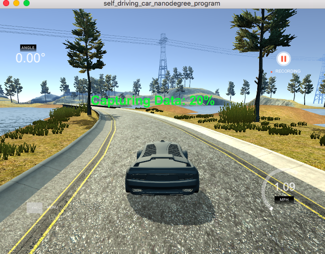
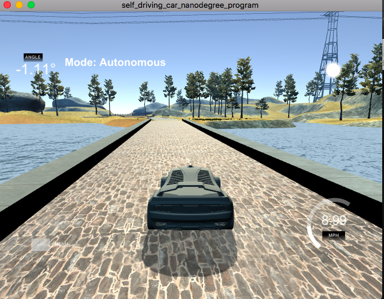
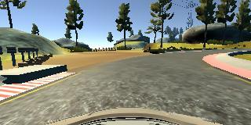

## 行为克隆

整个克隆的流程如下：
* 使用模拟器采集数据
* 数据处理
* 建立模型
* 训练模型和模型测试
* 在模拟器中测试模型
* 总结


1. 使用模拟器采集数据

   > 使车辆在track1中心跑一圈，在车道的右边跑一圈，向车道的反方向中心跑一圈。后来发现在车辆在第二个左转弯的处没有转过去，重新记录了一遍在此处的数据（哪个地方不会，就多教教它）。
   >
   > 采集的数据主要包括转向角度和图片，转向角度存于data/driving_log.csv文件，图片存于data/IMG文件夹下，使用图片作为输入数据，转动角度作为输出数据。

   

2. 数据预处理

   >读入转向角数据

   ```python
   import csv
   from sklearn.model_selection import train_test_split
   from sklearn.utils import shuffle
   import numpy as np
   import cv2

   samples = []
   def read_lines():
       """
       读取转动角度数据
       """
       with open('./nnn/driving_log.csv') as file:
           reader = csv.reader(file)
           for i, line in enumerate(reader):
               if i > 0:
                   samples.append(line)
       return samples

   # 打乱数据
   shuffle(samples)
   #把总体的数据分为训练集和验证集
   samples = read_lines()
   train_samples, validation_samples = train_test_split(samples, test_size=0.2)
   ```

   > 为了节省内存，使用了生成器，且对每一批次的数据，这样就不用把所有的图像数据一次性放入内存中，需要的时候再取。

   ```python
   def generator(samples, batch_size=32):
       """
       数据生成器
       """
       
       num_samples = len(samples)
       while 1:  # Loop forever so the generator never terminates
           for offset in range(0, num_samples, batch_size):
               batch_samples = samples[offset:offset + batch_size]
               images = []
               angles = []
               for i, batch_sample in enumerate(batch_samples):
                   name = './nnn/IMG/' + batch_sample[0].split('/')[-1]
                   center_image = cv2.imread(name)
                   center_angle = float(batch_sample[3])
                   images.append(center_image)
                   angles.append(center_angle)
                   # trim image to only see section with  road
               yield shuffle(np.array(images), np.array(angles))
   ```

3. 建立模型

   > 使用keras能快速建立模型，模型结构从如下代码观察一目了然。	
   >
   > 注意：对图像的上下部分进行了裁剪，保留了主要信息。

   ```python
   from keras.layers.core import Flatten, Dense, Activation
   from keras.layers.convolutional import Convolution2D
   from keras.models import Sequential
   from keras.layers import Cropping2D
   from keras import backend as K
   from keras.layers import Lambda

   def create_model_architecture():
       model = Sequential()
       model.add(Lambda(lambda x: x / 255 - 0.5, input_shape=(160, 320, 3)))
       model.add(Cropping2D(cropping=((70, 25), (0, 0))))
       model.add(Convolution2D(24, 5, 5, subsample=(2, 2)))
       model.add(Activation('relu'))
       model.add(Convolution2D(36, 5, 5, subsample=(2, 2)))
       model.add(Activation('relu'))
       model.add(Convolution2D(48, 5, 5, subsample=(2, 2)))
       model.add(Activation('relu'))
       model.add(Convolution2D(64, 3, 3))
       model.add(Activation('relu'))
       model.add(Convolution2D(84, 3, 3))
       model.add(Activation('relu'))
       model.add(Flatten())
       model.add(Dense(100))
       model.add(Dense(50))
       model.add(Dense(10))
       model.add(Dense(1))
       return model
   ```

4. 训练和测试模型

   > keras极大的简化了测试和训练过程。
   >
   > compile：设置损失函数和优化器
   >
   > fit_generator：使用生成器训练神经网络，其中
   >
   > ​				steps_per_epoch表示每一个epoch训练多少轮，
   >
   > ​				validation_steps表示验证集执行多少轮
   >
   > ​				nb_epoch：一共多少epoch
   >
   > ​				verbose：输出显示信息，可以为1或2							

   ```python
   # 训练数据集生成器和测试数据集生成器
   train_generator = generator(train_samples, batch_size=64)
   validation_generator = generator(validation_samples, batch_size=64)

   # 使用mse求损失函数，使用adam优化器。
   model.compile(loss='mse', optimizer='adam')
   model.fit_generator(train_generator, steps_per_epoch=len(train_samples) / 64, 				validation_data=validation_generator,validation_steps=len(validation_samples) / 		64, nb_epoch=5, verbose=1)

   model.save('model.h5')

   # 前面导入backend，在模型调用结束时清空一下。
   K.clear_session()
   ```

5. 把模型放到模拟器中进行测试

   

6. 生成视频，视频[地址](run1.mp4)

   

7. 总结

   关键分为两步，生成数据和训练数据

   数据特别重要，看在哪个地方出错，则在该地方多增加数据。

   keras快速构建模型特别有用，以后会常用。

